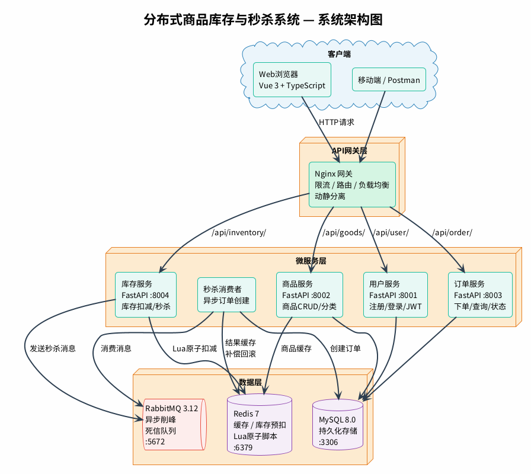
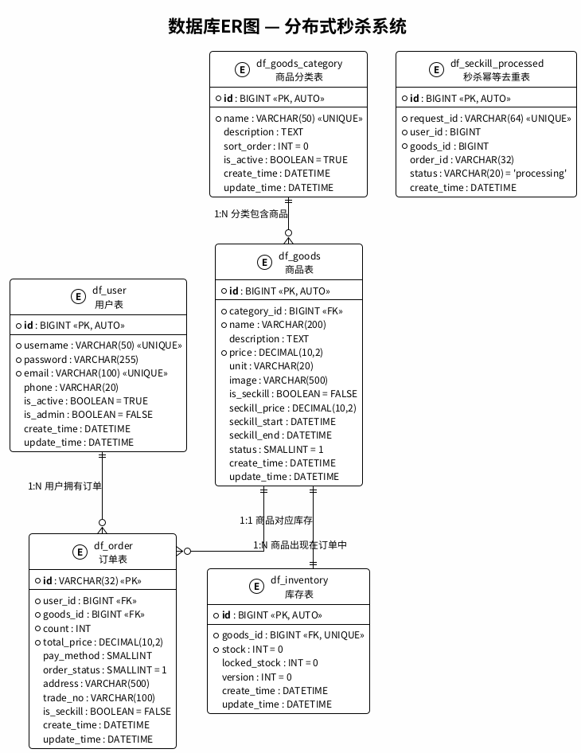
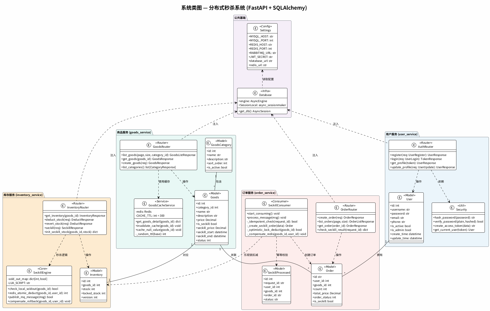
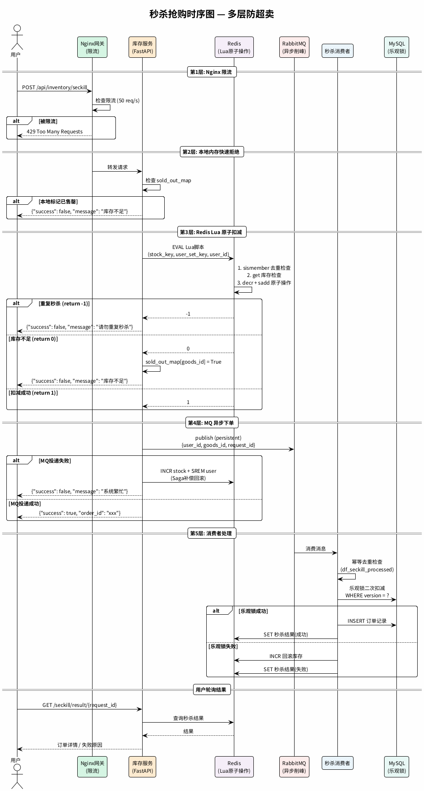

# 分布式商品库存与秒杀系统 — 系统设计文档

## 0. 系统架构图（PlantUML 生成）

### 系统架构总览


### 系统概览插图 (NanoBanana AI 生成)


### 数据库 ER 图


### 系统类图


### 秒杀时序图


---

## 1. 系统架构概览

> 完整架构图请参见上方 [系统架构图](diagrams/architecture.png)。

### 1.1 服务拆分说明

| 服务         | 职责                          | 端口 |
|--------------|-------------------------------|------|
| 用户服务     | 注册、登录、JWT认证、用户信息管理 | 8001 |
| 商品服务     | 商品CRUD、分类、搜索、详情      | 8002 |
| 订单服务     | 下单、订单查询、订单状态管理     | 8003 |
| 库存服务     | 库存查询、库存扣减、秒杀逻辑     | 8004 |

### 1.2 服务间通信

- **同步调用**: 服务间通过 HTTP REST 调用（如订单服务调用库存服务扣减库存）
- **异步通信**: 通过 RabbitMQ 消息队列处理秒杀订单异步下单
- **数据缓存**: Redis 缓存热点商品信息和库存预扣减

---

## 2. 各服务 API 接口定义（RESTful）

### 2.1 用户服务 (User Service) — `/api/user`

| 方法   | 路径                | 说明           | 请求体                                          | 响应                              |
|--------|---------------------|----------------|------------------------------------------------|-----------------------------------|
| POST   | `/register`         | 用户注册       | `{username, password, email}`                  | `{id, username, email}`           |
| POST   | `/login`            | 用户登录       | `{username, password}`                         | `{access_token, token_type}`      |
| GET    | `/profile`          | 获取用户信息   | Header: `Authorization: Bearer <token>`         | `{id, username, email, ...}`      |
| PUT    | `/profile`          | 更新用户信息   | `{email?, phone?}`                             | `{id, username, email, ...}`      |

### 2.2 商品服务 (Goods Service) — `/api/goods`

| 方法   | 路径                | 说明           | 请求体/参数                                     | 响应                              |
|--------|---------------------|----------------|------------------------------------------------|-----------------------------------|
| GET    | `/`                 | 商品列表       | `?page=1&size=20&category_id=`                 | `{items: [...], total, page}`     |
| GET    | `/{goods_id}`       | 商品详情       | -                                              | `{id, name, price, stock, ...}`   |
| POST   | `/`                 | 创建商品(管理) | `{name, desc, price, category_id, stock}`      | `{id, name, ...}`                 |
| PUT    | `/{goods_id}`       | 更新商品(管理) | `{name?, desc?, price?}`                       | `{id, name, ...}`                 |
| DELETE | `/{goods_id}`       | 删除商品(管理) | -                                              | `{message}`                       |
| GET    | `/categories`       | 商品分类列表   | -                                              | `[{id, name}, ...]`               |

### 2.3 订单服务 (Order Service) — `/api/order`

| 方法   | 路径                | 说明           | 请求体/参数                                     | 响应                              |
|--------|---------------------|----------------|------------------------------------------------|-----------------------------------|
| POST   | `/`                 | 创建订单       | `{goods_id, count, address_id}`                | `{order_id, status, ...}`         |
| GET    | `/`                 | 订单列表       | `?page=1&size=10&status=`                      | `{items: [...], total}`           |
| GET    | `/{order_id}`       | 订单详情       | -                                              | `{order_id, goods, status, ...}`  |
| PUT    | `/{order_id}/pay`   | 订单支付       | `{pay_method}`                                 | `{order_id, status}`              |
| PUT    | `/{order_id}/cancel`| 取消订单       | -                                              | `{order_id, status}`              |

### 2.4 库存服务 (Inventory Service) — `/api/inventory`

| 方法   | 路径                      | 说明           | 请求体/参数                              | 响应                              |
|--------|---------------------------|----------------|----------------------------------------|-----------------------------------|
| GET    | `/{goods_id}`             | 查询库存       | -                                      | `{goods_id, stock}`               |
| POST   | `/deduct`                 | 扣减库存       | `{goods_id, count}`                    | `{success, remaining}`            |
| POST   | `/revert`                 | 回滚库存       | `{goods_id, count}`                    | `{success, remaining}`            |
| POST   | `/seckill`                | 秒杀抢购       | `{goods_id, user_id}`                  | `{success, order_id/message}`     |
| POST   | `/init/{goods_id}`        | 初始化秒杀库存 | `{stock}`                              | `{success}`                       |

---

## 3. 数据库 ER 图

> 完整 ER 图请参见上方 [数据库ER图](diagrams/er_diagram.png)。

以下为各表主要字段说明：

**df_user**: id, username, password, email, phone, is_active, is_admin, create_time, update_time

**df_goods_category**: id, name, description, sort_order, is_active, create_time, update_time

**df_goods**: id, category_id(FK), name, desc, price, unit, image, is_seckill, seckill_price, seckill_start, seckill_end, status, create_time, update_time

**df_inventory**: id, goods_id(FK, UNIQUE), stock, locked_stock, version(乐观锁), create_time, update_time

**df_order**: id(订单号), user_id(FK), goods_id(FK), count, total_price, pay_method, order_status, address, trade_no, is_seckill, create_time, update_time

### 3.1 表关系说明

- **df_user ↔ df_order**: 一对多，一个用户可有多个订单
- **df_goods_category ↔ df_goods**: 一对多，一个分类下有多个商品
- **df_goods ↔ df_inventory**: 一对一，每个商品对应一条库存记录
- **df_goods ↔ df_order**: 一对多，一个商品可出现在多个订单中

---

## 4. 技术栈选型说明

### 4.1 编程语言与框架

| 组件          | 选型           | 理由                                                        |
|---------------|----------------|-------------------------------------------------------------|
| 编程语言      | **Python 3.11+** | 团队技术栈要求，生态丰富                                     |
| Web框架       | **FastAPI**      | 异步高性能、自动OpenAPI文档、类型提示、适合微服务              |
| ORM           | **SQLAlchemy 2.0**| 成熟稳定，支持异步（async），与FastAPI配合良好                 |
| 数据校验      | **Pydantic v2**  | FastAPI内置支持，类型安全                                     |

### 4.2 中间件

| 组件          | 选型           | 理由                                                        |
|---------------|----------------|-------------------------------------------------------------|
| 关系数据库    | **MySQL 8.0**    | 成熟稳定，适合事务性业务数据                                  |
| 缓存/库存     | **Redis 7**      | 高性能内存存储，Lua脚本原子扣减库存，支持分布式锁              |
| 消息队列      | **RabbitMQ 3.12** | 可靠消息投递，支持死信队列处理超时订单                         |
| API网关       | **Nginx**        | 反向代理、负载均衡、限流                                      |

### 4.3 基础设施

| 组件          | 选型           | 理由                                                        |
|---------------|----------------|-------------------------------------------------------------|
| 容器化        | **Docker + Docker Compose** | 标准化部署，环境一致性                              |
| 认证方式      | **JWT (jose)**   | 无状态认证，适合分布式服务                                    |
| 异步驱动      | **asyncio + uvicorn** | 充分利用Python协程处理高并发                            |
| DB驱动        | **aiomysql**     | MySQL异步驱动，配合SQLAlchemy async                           |

### 4.4 秒杀核心方案

> **详细设计见 [SECKILL_DESIGN.md](./SECKILL_DESIGN.md)**

1. **Redis预扣库存**: 秒杀开始前将库存加载到Redis，使用Lua脚本原子扣减
2. **RabbitMQ异步下单**: 扣减成功后发送消息到队列，订单服务异步消费创建订单
3. **乐观锁兜底**: 数据库层面使用version字段进行乐观锁校验，防止超卖
4. **限流防刷**: Nginx层面限制请求频率，服务层面校验用户重复秒杀
5. **本地售罄标记**: 库存耗尽后进程内缓存拒绝，不再访问Redis
6. **幂等去重**: 全链路 request_id + df_seckill_processed 表防止重复消费
7. **Saga补偿**: MQ/DB失败时自动回滚Redis库存

---

## 5. 项目目录结构

```
Python-DisSecKill/
├── docs/                        # 文档
│   └── DESIGN.md
├── docker-compose.yml           # 容器编排
├── .env.example                 # 环境变量模板
├── gateway/                     # API网关
│   └── nginx.conf
├── services/                    # 微服务
│   ├── user_service/            # 用户服务
│   │   ├── Dockerfile
│   │   ├── requirements.txt
│   │   └── app/
│   │       ├── main.py          # 入口
│   │       ├── config.py        # 配置
│   │       ├── database.py      # 数据库连接
│   │       ├── models.py        # ORM模型
│   │       ├── schemas.py       # Pydantic模型
│   │       └── routers/
│   │           └── auth.py      # 认证路由
│   ├── goods_service/           # 商品服务
│   ├── order_service/           # 订单服务
│   └── inventory_service/       # 库存服务
└── scripts/                     # 工具脚本
    └── init_db.sql              # 数据库初始化
```

---

## 6. 负载均衡设计

### 6.1 多实例部署

每个后端微服务可启动多个实例，通过 Docker Compose `deploy.replicas` 或手动指定多端口实现：

```yaml
# docker-compose.yml 中 goods-service 示例
goods-service-1:
  build: ./services/goods_service
  ports: ["8002:8002"]

goods-service-2:
  build: ./services/goods_service
  ports: ["8012:8002"]
```

### 6.2 Nginx 负载均衡算法

| 算法 | 配置指令 | 说明 |
|------|---------|------|
| 轮询（默认） | 无需额外指令 | 依次转发到每个后端，适合性能均匀的场景 |
| 加权轮询 | `server xxx weight=3;` | 按权重分配，性能强的节点分配更多请求 |
| IP Hash | `ip_hash;` | 按客户端IP分配，保证同一用户请求同一后端，适合有状态会话 |
| 最少连接 | `least_conn;` | 转发到当前连接数最少的后端，适合请求处理耗时不均匀 |

```nginx
# gateway/nginx.conf — 多实例轮询配置
upstream goods_service {
    # 算法切换：取消注释对应行
    # ip_hash;
    # least_conn;
    server goods-service-1:8002;
    server goods-service-2:8002;
}
```

### 6.3 压力测试验证

使用 Locust (Python版JMeter) 进行压力测试：

```bash
# 启动压测
locust -f tests/locustfile.py --host=http://localhost --headless \
    -u 200 -r 20 --run-time 60s
```

验证要点：
- 观察 Nginx access.log 或后端日志，确认请求均匀分布
- 检查各实例的 `/health` 端点响应时间
- 对比不同负载均衡算法下的 p50/p95/p99 延迟

---

## 7. 动静分离设计

### 7.1 架构说明

将前端静态资源（HTML/CSS/JS/图片）和后端 API 请求通过 Nginx 分离处理：

- `/api/*` — 反向代理到后端微服务（动态请求）
- `/static/*` — Nginx 直接返回静态文件（零后端开销）
- `/` — Nginx 返回 `index.html`（SPA 入口）

### 7.2 Nginx 配置

```nginx
server {
    listen 80;

    # 静态资源：Nginx直接服务，开启缓存
    location /static/ {
        alias /usr/share/nginx/html/static/;
        expires 7d;
        add_header Cache-Control "public, immutable";
        access_log off;  # 静态资源不记录日志，提升性能
    }

    # 前端SPA入口
    location / {
        root /usr/share/nginx/html;
        try_files $uri $uri/ /index.html;
    }

    # 动态API请求：代理到后端
    location /api/ {
        proxy_pass http://backend_upstream;
    }
}
```

### 7.3 性能对比测试

```bash
# 压测静态文件 (预期: 更高吞吐、更低延迟)
locust -f tests/locustfile.py --host=http://localhost --headless \
    -u 500 -r 50 --run-time 30s --tags static

# 压测动态API (预期: 较低吞吐、较高延迟)
locust -f tests/locustfile.py --host=http://localhost --headless \
    -u 200 -r 20 --run-time 30s --tags api
```

---

## 8. 分布式缓存设计

### 8.1 商品详情页缓存

使用 Redis 缓存商品详情，减少数据库查询：

```python
# 缓存策略
GET /api/goods/{goods_id}
    → 先查Redis → 命中则直接返回
    → 未命中则查MySQL → 写入Redis（带TTL）→ 返回
```

### 8.2 缓存三大问题及解决方案

| 问题 | 描述 | 解决方案 |
|------|------|---------|
| **缓存穿透** | 大量请求查询不存在的数据，绕过缓存直接打到数据库 | 1. 缓存空值(null value)，TTL设短(60s) <br> 2. 布隆过滤器前置拦截 |
| **缓存击穿** | 热点key过期瞬间，大量并发请求同时打到数据库 | 1. 互斥锁(Redis SETNX)，只允许一个请求回源 <br> 2. 逻辑过期(不设TTL，由后台线程异步更新) |
| **缓存雪崩** | 大量key同时过期，导致数据库压力突增 | 1. TTL加随机偏移量(±30s) <br> 2. 多级缓存(本地缓存+Redis) <br> 3. 限流降级兜底 |

### 8.3 实现细节

```python
class GoodsCacheService:
    CACHE_PREFIX = "goods:detail:"
    NULL_PREFIX = "goods:null:"
    LOCK_PREFIX = "goods:lock:"
    CACHE_TTL = 300        # 正常缓存5分钟
    NULL_TTL = 60          # 空值缓存1分钟
    LOCK_TTL = 10          # 分布式锁10秒

    async def get_goods_detail(self, goods_id: int):
        cache_key = f"{self.CACHE_PREFIX}{goods_id}"

        # 1. 查缓存
        cached = await self.redis.get(cache_key)
        if cached:
            return json.loads(cached)

        # 2. 检查空值缓存（防穿透）
        if await self.redis.exists(f"{self.NULL_PREFIX}{goods_id}"):
            return None

        # 3. 抢分布式锁（防击穿）
        lock_key = f"{self.LOCK_PREFIX}{goods_id}"
        acquired = await self.redis.set(lock_key, "1", ex=self.LOCK_TTL, nx=True)
        if not acquired:
            await asyncio.sleep(0.1)  # 等待重试
            return await self.get_goods_detail(goods_id)

        try:
            # 4. 查数据库
            goods = await self._query_db(goods_id)
            if goods is None:
                await self.redis.set(f"{self.NULL_PREFIX}{goods_id}", "1", ex=self.NULL_TTL)
                return None
            # 5. 写缓存（TTL加随机偏移防雪崩）
            ttl = self.CACHE_TTL + random.randint(-30, 30)
            await self.redis.set(cache_key, json.dumps(goods), ex=ttl)
            return goods
        finally:
            await self.redis.delete(lock_key)
```

---

## 9. 容器环境说明

### 9.1 各服务 Dockerfile

所有微服务采用统一的 Dockerfile 模板：

```dockerfile
FROM python:3.11-slim
WORKDIR /app
COPY requirements.txt .
RUN pip install --no-cache-dir -r requirements.txt
COPY . .
EXPOSE 800x
CMD ["uvicorn", "app.main:app", "--host", "0.0.0.0", "--port", "800x"]
```

### 9.2 Docker Compose 编排

| 层级 | 组件 |
|------|------|
| 基础设施 | MySQL 8.0、Redis 7、RabbitMQ 3.12 |
| 微服务层 | user-service ×2、goods-service ×2、order-service ×2、inventory-service ×2、seckill-consumer ×1 |
| 网关层 | Nginx（80 端口）— 负载均衡 / 动静分离 / 限流 |
| 前端 | Vue 3 SPA（Nginx 内部容器） |

启动命令：
```bash
docker-compose up -d --build
```
